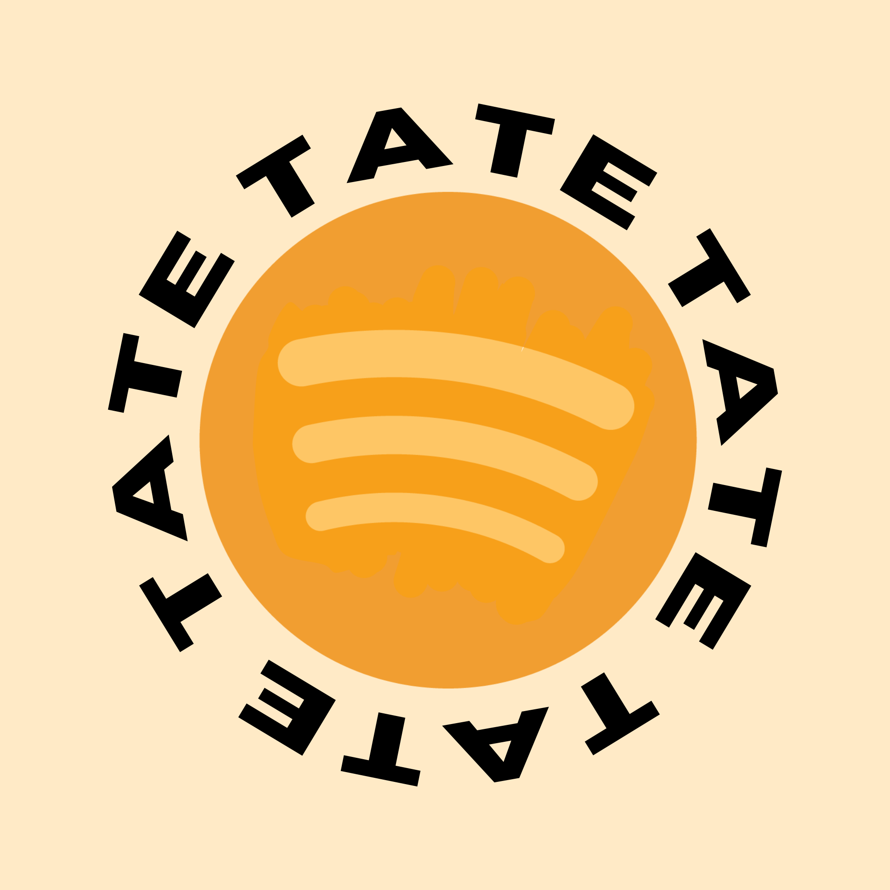

  
  <h1>TATEIFY</h1>
  
Stream every song.

---

## about TATEIFY
TATEIFY is a dedicated music streaming platform designed for fans to be able to stream all of her songs for free, with no login, at 320 kb/s

---

## discography:

### albums
* **SO CLOSE TO WHAT??? (Deluxe)** (2025)
* **So Close to What** (2025)
* **THINK LATER** (2023)
* **i used to think i could fly** (2022)

### eps
* **TOO YOUNG TO BE SAD** (2021)
* **all the things i never said** (2020)
* **The One Day LP** (2017–2019 / Re-released 2025)

### Singles & Collaborations
* **2025:** *Tit for Tat*, *Nobody’s Girl*, *Revolving Door*, *Sports Car*, *Just Keep Watching* (from F1: The Movie)
* **2024:** *2 hands*, *It’s OK I’m OK*
* **2023:** *Exes*, *Greedy*, *10:35* (with Tiësto)
* **2022:** *uh oh*, *don't come back*, *what would you do?*, *chaotic*, *she's all i wanna be*
* **2021:** *feel like shit*, *working* (with Khalid), *u love u* (with blackbear), *you* (with Regard & Troye Sivan), *rubberband*
* **2020:** *r u ok*, *lie to me* (with Ali Gatie), *don't be sad*, *vicious* (feat. Lil Mosey), *you broke me first*
* **2019:** *stupid*, *all my friends are fake*, *tear myself apart*, *kids are alright*, *slip*
* **2017–2018:** *drown*, *distant*, *shoulder to shoulder*, *teenage mind*, *can’t get it out*, *hung up on you*, *one day*

---

## installation
1. clone my repo with `git clone https://github.com/silaspuma/tateify.git`
2. install dependencies with `npm install`
3. launch the app with `npm start`!

## general use / no installation version
1. open [tateify.netlify.app](https://tateify.netlify.app)
2. start listening! :3
